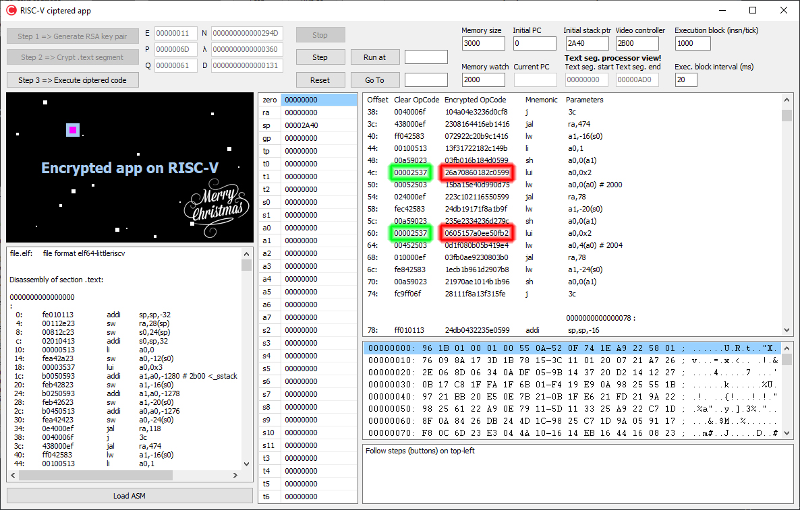

# Encrypted app on RISC-V

This repository houses a RV32I emulator which execute RSA encrypted code.

ball.c is the source code of program used in visualizer.

Take a look of [original repo](https://github.com/dgiovanardi/simulation-on-risc-v) to compile this project.

## Concept (in data centers or cloud environments)

Send (execute) an secured code to a specific core in a cluster. Encryption is done by asymmetric algorithm. No one except target processor MMU can decrypt the code because it is the unique holder of the private key.

## Workflow

1. Another (remote) processor has the public key and crypts the code;

2. Logic in the middle brings the secured code to MMU memory space of destination processor;

3. Target processor MMU recognize the secured code in instruction memory and decrypt it in L1i cache (now plain code resides only in a exclusive local memory and cannot be extracted);

4. (To do) Code can holds unreachable execution area which contains the source processor signature for validation. Signature should be validated by MMU.

## Dependencies and Credits

- [Lucas Teske's RISC-V Online Assembler](https://riscvasm.lucasteske.dev/#)
- [GNU Compiler Collection](https://github.com/gcc-mirror/gcc/) for ball.c sample file

## License

This repository is licensed under the GNU GPLv3.

The RISC-V trade name is a registered trademark of RISC-V International.